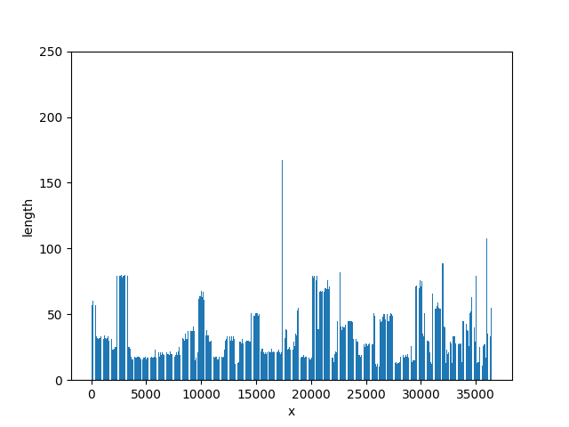

# 实验六

## 实验选题
实验选题为kaggle上Featured Code Competition，题目为[U.S. Patent Phrase to Phrase Matching](https://www.kaggle.com/competitions/us-patent-phrase-to-phrase-matching/overview).

## 实验数据
### 训练数据
训练数据如下图所示，对于给定的anchor和target，给出其相匹配的程度，例如，如果一项发明声称是“电视机”，而先前的出版物描述了“电视机”，那么理想情况下，模型会识别出这两者是相同的，并帮助专利律师或审查员检索相关文件。  

  

### 测试数据
测试数据如下图所示，需要给出anchor和target的相关程度，并给出了相关的上下文的符号。  

  

### 数据分布
将test中的anchor和target连接到Cooperative Patent Classification Codes Meaning数据中，获取相关的上下文信息，并构建dataset。   
采样数据的分布，使用DeBerta分词器对待分类的句子分词，分词后的数据分布如下:  

  

在后续处理中，将句子截断为100，对不足100的补齐。  


## 实验内容
基于DeBerta构建训练系统。


## 目录结构
```
│  README.md
│  
├─Code
│  │  ClassificationDeBerta.py
│  │  ClassificationDeBertaTest.py
│  │  statics.py
│  │  
│  ├─checkpoint-9120
│  │      added_tokens.json
│  │      config.json
│  │      optimizer.pt
│  │      pytorch_model.bin
│  │      rng_state.pth
│  │      scheduler.pt
│  │      special_tokens_map.json
│  │      spm.model
│  │      tokenizer_config.json
│  │      trainer_state.json
│  │      training_args.bin
│  │      
│  ├─input
│  │      sample_submission.csv
│  │      test.csv
│  │      titles.csv
│  │      train.csv
│  │      
│  └─pretrained
│          config.json
│          pytorch_model.bin
│          spm.model
│          tokenizer_config.json
│          
└─Report
        refs.bib
        Report.aux
        Report.bbl
        Report.blg
        Report.log
        Report.out
        Report.pdf
        Report.synctex.gz
        Report.tex
        Report.toc
        score.png
        statics.png
        test.png
        theme.png
        train.png
```
